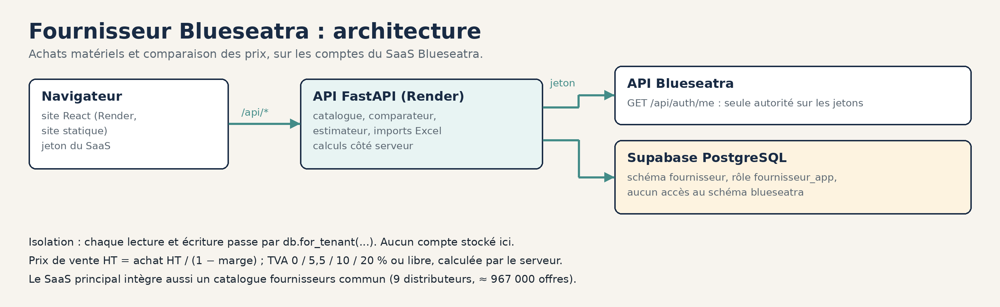

<div align="center">


### Fournisseur Blueseatra : achats matériels TCE et comparaison des prix fournisseurs

Catalogue matériels, comparateur multi-fournisseurs et estimateur de projet, cloisonnés par entreprise et connectés aux comptes du SaaS [Blueseatra](https://github.com/zehair-louzza/Blueseatra).

    [](./LICENSE)

[**Déploiement**](./DEPLOIEMENT.md) · [**Cahier des charges**](./memory/PRD.md) · [**Recherche par mots**](./docs/recherche-par-mots.md) · [**SaaS Blueseatra**](https://github.com/zehair-louzza/Blueseatra) · [**Site**](https://blueseatra.com) · [**Licence**](./LICENSE)

</div>

---

## En bref

| Sujet | En pratique |
|---|---|
| **Pour qui** | Chiffreurs et acheteurs d'entreprises TCE |
| **Ce que ça fait** | Catalogue matériels par lot, comparaison des prix de plusieurs enseignes, estimation de projet avec marge et TVA |
| **Comptes** | Aucun compte stocké ici : connexion par l'API du SaaS Blueseatra, qui reste seule autorité sur les jetons |
| **Isolation** | Chaque lecture et écriture passe par `db.for_tenant(...)` ; le rôle `fournisseur_app` n'a aucun accès au schéma `blueseatra` |
| **Calculs** | Côté serveur : prix de vente HT = achat HT / (1 − marge), TVA 0 / 5,5 / 10 / 20 % ou libre |

## Fonctionnalités

- **Tableau de bord décisionnel** : économie fiable (hors prix « à vérifier »), meilleures opportunités, fournisseur recommandé par lot, répartition fiabilité et disponibilité.
- **Catalogue** : recherche par mots (chaque mot, dans n'importe quel ordre, sans tenir compte des accents ni du pluriel ; voir [docs/recherche-par-mots.md](docs/recherche-par-mots.md)), filtres par lot, fournisseur et fiabilité, fiche détaillée avec toutes les offres examinées ; onglets « Produits examinés » et « Prix retenus ».
- **Comparateur de prix** : matrice multi-enseignes, meilleur prix mis en évidence, économie et écart moyen.
- **Estimateur de projet** : lignes éditables (quantité, marge, TVA), marge par lot, récapitulatif achat / marge / HT / TVA / TTC, sauvegarde des projets.
- **Fournisseurs** : analyse par enseigne.
- **Alertes qualité** : articles à compléter ou à vérifier, contrôles de cohérence.
- **Import Excel** : mise à jour du catalogue (`POST /api/catalogue/import`) ou d'un fournisseur (`POST /api/fournisseurs/{fournisseur}/import`).

## Architecture



Schéma généré par [`scripts/docs/generer_schemas_ecosysteme.py`](https://github.com/zehair-louzza/Blueseatra/blob/main/scripts/docs/generer_schemas_ecosysteme.py) dans le dépôt Blueseatra.

<details>
<summary>Vue texte</summary>

```text
Navigateur ── React (Render, site statique, HashRouter)
                 │  jeton du SaaS
                 ▼
          FastAPI /api/* (Render) ──► API Blueseatra /api/auth/me  (validation du jeton)
                 │
                 ▼
          Supabase PostgreSQL, schéma `fournisseur` (documents JSONB, index SQL)
```

</details>

## Structure

| Chemin | Rôle |
|---|---|
| `backend/server.py` | API FastAPI : catalogue, statistiques, projets, comparateur, imports |
| `backend/auth.py` | Validation des jetons auprès du SaaS, avec cache |
| `backend/db_postgres.py` | Accès PostgreSQL cloisonné par entreprise |
| `backend/catalogue_parser.py`, `supplier_import.py` | Lecture des classeurs Excel fournisseurs |
| `backend/tests/` | Tests : calculs, isolation entre entreprises, intégration PostgreSQL, import |
| `frontend/src/pages/` | Tableau de bord, Catalogue, Comparateur, Estimateur, Fournisseurs, Alertes, Paramètres, Connexion |
| `server.py`, `requirements.txt` (racine) | Point d'entrée pour Render, qui démarre depuis la racine |
| `ingest.py` | Conversion du classeur `catalogue.xlsx` en `backend/catalogue_data.json` |

## Démarrage local

```bash
# API
cd backend
pip install -r requirements.txt
export DATABASE_URL=...   # rôle fournisseur_app, jamais postgres
export SAAS_API_URL=https://blueseatra-api.onrender.com
uvicorn server:app --reload --port 8002

# Interface
cd frontend
npm install
REACT_APP_BACKEND_URL=http://localhost:8002 REACT_APP_SAAS_API_URL=https://blueseatra-api.onrender.com npm start
```

Variables, hébergement et règles de cloisonnement : voir **[DEPLOIEMENT.md](./DEPLOIEMENT.md)**.

## Tests

```bash
cd backend && pytest
```

## Principales routes

| Méthode | Route | Rôle |
|---|---|---|
| POST | `/api/auth/login` | Connexion relayée vers le SaaS |
| GET | `/api/me` | Utilisateur et entreprise connectés |
| GET | `/api/catalogue`, `/api/catalogue/{code}` | Articles et offres |
| GET | `/api/comparateur` | Matrice de prix multi-fournisseurs |
| GET | `/api/stats/overview`, `/by-lot`, `/by-supplier`, `/decision` | Indicateurs |
| GET | `/api/alerts` | Alertes qualité |
| GET / POST / PUT / DELETE | `/api/projects` | Projets d'estimation |
| POST | `/api/best-prices` | Meilleurs prix pour une liste d'articles |
| POST | `/api/catalogue/import`, `/api/fournisseurs/{fournisseur}/import` | Imports Excel |
| GET | `/api/health` | Contrôle de santé |

## Lien avec le SaaS Blueseatra

Le SaaS principal intègre désormais un catalogue fournisseurs commun (9 distributeurs, environ 967 000 références) et un comparateur de prix. Ce dépôt reste le module d'achats et d'estimation par lot, qui s'appuie sur les mêmes comptes.

## Licence

Logiciel **propriétaire**. Titulaire des droits : **Zehair Louzza**, exploitant le nom commercial « Blueseatra ». Le texte qui fait foi est le fichier [LICENSE](./LICENSE), version 2.0 du 10 octobre 2026.

| Point | En pratique |
|---|---|
| Ce qui est protégé | Code, documentation, schémas, nom et logo, catalogues et données normalisées |
| Ce que la publication sur GitHub permet | Consulter le dépôt et le dupliquer (« fork ») sur GitHub, comme l'imposent les conditions de GitHub. Rien d'autre |
| Ce qui est interdit sans accord écrit | Copier, exécuter, modifier, redistribuer, proposer en SaaS, bâtir un produit concurrent, extraire les catalogues |
| Intelligence artificielle | Opposition à la fouille de textes et de données (article L.122-5-3 du CPI) : aucun entraînement de modèle sur ce dépôt |
| Tarifs et marques des distributeurs | Ils appartiennent à leurs titulaires ; aucun droit sur eux n'est concédé |
| Contributions | Acceptées seulement avec cession des droits au titulaire |
| Droit applicable | Droit français, tribunaux du ressort de la cour d'appel de Paris |

Demande d'autorisation : `contact@blueseatra.com`.

---

<sub>© 2025-2026 Zehair Louzza, exploitant le nom commercial « Blueseatra ». Logiciel propriétaire, tous droits réservés. Voir [LICENSE](./LICENSE).</sub>
